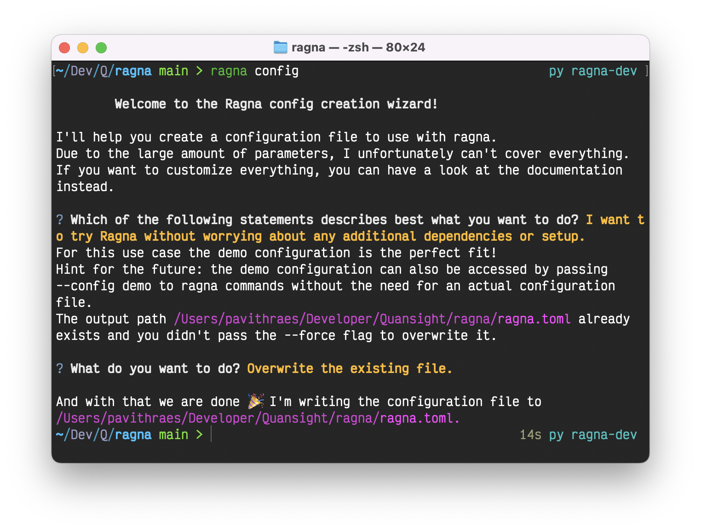

# Set configuration

Ragna's configuration includes setting the LLM, source storage, API endpoint, UI port,
and more. Your chat will use these configurations by default when provided.

## Create a configuration file

Storing your Ragna configuration in a file is the recommended approach for any serious
workflows. Ragna includes a CLI wizard to walk you through the process of creating this
file.

Run the following command, and answer the questions when prompted:

```bash
ragna config
```



At the end, this will create a `ragna.toml` file based on your choices.

Here's an example configuration file:

```toml
local_cache_root = "/home/<user>/.cache/ragna"

[rag]
queue_url = "memory"
document = "ragna.core.LocalDocument"
source_storages = ["ragna.source_storages.Chroma", "ragna.source_storages.RagnaDemoSourceStorage", "ragna.source_storages.LanceDB"]
assistants = ["ragna.assistants.RagnaDemoAssistant"]

[api]
url = "http://127.0.0.1:31476"
database_url = "memory"
upload_token_secret = "XXXXXXXXXXXXXXXXXXXXXXXXXXXXXXXX"
upload_token_ttl = 300

[ui]
url = "http://127.0.0.1:31477"
```

## Set configuration using the file

You can now use this configuration file for setting configurations in your applications:

```py
from ragna import Config

config_path ="path-to-config-file"
config = Config.from_file(config_path)
```

!!! note

    In the Python API, the `Rag.chat()` function also allows you to set certain RAG-specific configurations like `document` and `assistants`. However, the configuration file is required when using the REST API.
