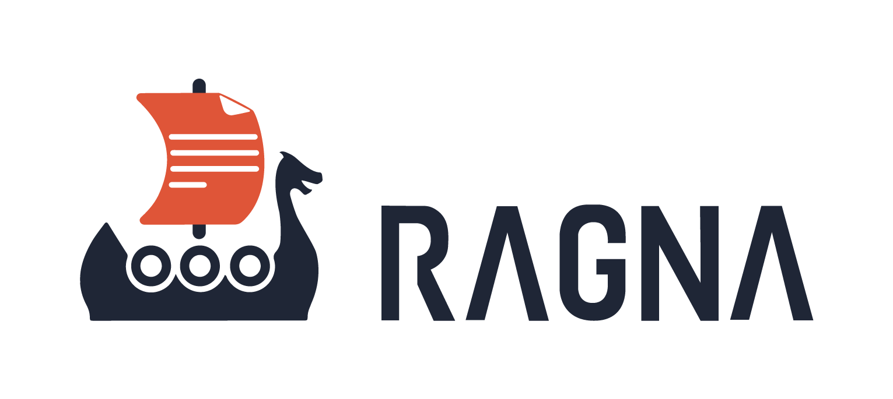

# 

Ragna is an open source RAG orchestration framework.

With an intuitive API for quick experimentation and built-in tools for creating production-ready application, you can quickly quickly Large Language Models (LLMs) for your work.

[Get started](get-started.md){ .md-button }

## Key features

<!-- TODO: Switch to Card grid when it's available in the OSS version.
Ref: https://squidfunk.github.io/mkdocs-material/reference/grids/#using-card-grids -->

### Python API designed for experimentation  :fontawesome-solid-flask:{ .icon }

Explore and test different LLMs quickly in Python.

[Learn more →](tutorials/python-api.md)

### Web UI for chat interface  :fontawesome-solid-window-maximize:{ .icon }

Select and configure LLMs, upload documents, and chat with the LLM with a web application. Use it out-of-the-box or as a reference to build custom web applications.

[Learn more →](tutorials/rest-api.md)

### REST API to build web apps :fontawesome-solid-bolt:{ .icon }

Create custom RAG-based web applications for your particular needs.

[Learn more →](tutorials/web-app.md)

### Free and Open Source in ethos :fontawesome-solid-heart:{ .icon }

Ragna is developed and distributed under the permissive BSD 3-Clause License for open source software.

[Join the community →](community/contribute.md)
